# 🏦 하나은행 스마트 금융 상담 시스템 v2.0

실제 은행 창구와 동일한 경험을 제공하는 지능형 금융 상담 시스템입니다. 직원용 PC와 고객용 태블릿이 실시간으로 연동되어 seamless한 상담 서비스를 구현합니다.

**🚀 v2.0 업데이트: Spring Boot + React 아키텍처로 전면 개편!**


## 📋 목차
- [✨ 주요 기능](#-주요-기능)
- [🛠️ 기술 스택](#️-기술-스택)
- [🚀 빠른 시작](#-빠른-시작)
- [📖 사용 방법](#-사용-방법)
- [🏗️ 시스템 구조](#️-시스템-구조)
- [📊 데이터베이스](#-데이터베이스)
- [🔧 개발 환경](#-개발-환경)
- [🤝 기여하기](#-기여하기)

## ✨ 주요 기능

### 🏛️ 실제 은행 창구 환경 구현
- **직원용 PC**: 고객 관리, 상품 탐색, 상담 진행
- **고객용 태블릿**: 실시간 정보 확인, 상품 상세보기
- **실시간 동기화**: STOMP WebSocket을 통한 즉시 화면 연동

### 👥 고객 관리 시스템
- **OCR 신분증 인식**: 실제 신분증 스캔 (시뮬레이션)
- **테스트 고객 데이터**: 5명의 샘플 고객 제공
- **보유 상품 현황**: 예금, 적금, 대출 등 전체 포트폴리오 표시
- **자산/부채 요약**: 총 자산, 총 부채, 순자산 자동 계산

### 💰 금융 상품 관리
- **179개 실제 하나은행 상품**: JSON 데이터 기반
- **스마트 검색**: 상품명, 타입, 특징으로 필터링
- **상품 비교**: 최대 3개 상품 동시 비교
- **우대금리 표시**: 기존 고객 혜택 강조

### 🔄 실시간 상담 기능
- **화면 동기화**: 직원 PC에서 상품 선택 시 고객 태블릿에 즉시 표시
- **세션 관리**: 직원-고객 1:1 매칭 시스템
- **상담 히스토리**: 진행 상황 추적

## 🛠️ 기술 스택

### Backend
- **Spring Boot 3.2**: 엔터프라이즈급 Java 프레임워크
- **Spring Data JPA**: 데이터베이스 ORM
- **Spring Security**: 보안 및 인증
- **Spring WebSocket (STOMP)**: 실시간 양방향 통신
- **H2 Database**: 인메모리 데이터베이스 (개발용)
- **JWT**: 토큰 기반 인증
- **BCrypt**: 비밀번호 암호화
- **Maven**: 빌드 도구

### Frontend
- **React 18**: 사용자 인터페이스
- **Styled Components**: CSS-in-JS 스타일링
- **Axios**: HTTP 클라이언트
- **@stomp/stompjs**: STOMP WebSocket 클라이언트
- **sockjs-client**: WebSocket 폴백 지원

### Database Schema
```sql
-- 직원 정보
employees (id, employee_id, name, password, position)

-- 고객 정보  
customers (customer_id, name, phone, age, address, income, assets)

-- 고객 보유 상품
customer_products (id, customer_id, product_name, balance, interest_rate)

-- 금융 상품
financial_products (id, product_name, product_type, interest_rate, product_features)

-- 상담 세션
consultation_sessions (id, session_id, employee_id, customer_id)
```

## 🚀 빠른 시작

### 필수 요구사항
- **Java 17 이상**
- **Node.js 16.0 이상**
- **npm 8.0 이상**

### Windows 자동 실행

#### 백엔드 서버 시작
```cmd
start-backend.bat
```

#### 프론트엔드 서버 시작 (새 터미널)
```cmd
start-frontend.bat
```

### 수동 설치 및 실행

#### 1. 저장소 클론
```bash
git clone https://github.com/ppdoli123/bank-teller-workspace.git
cd bank-teller-workspace
```

#### 2. Spring Boot 백엔드 설치 및 실행
```bash
# 백엔드 디렉토리로 이동
cd backend

# Maven으로 의존성 설치 및 실행
./mvnw spring-boot:run
```

#### 3. React 클라이언트 설치 및 실행 (새 터미널)
```bash
# 클라이언트 디렉토리로 이동
cd client

# npm 의존성 설치
npm install

# 개발 서버 시작
npm start
```

## 📖 사용 방법

### 1. 시스템 접속
- **직원용**: http://localhost:3000
- **고객 태블릿**: http://localhost:3000/tablet

### 2. 직원 로그인
```
ID: 1234
비밀번호: 1234
```

### 3. 고객 상담 시작
1. **고객 선택**: "🧪 테스트 고객 선택" 버튼 클릭
2. **고객 정보 확인**: 태블릿에서 고객 정보 자동 표시
3. **보유 상품 검토**: 기존 예금, 적금, 대출 현황 확인
4. **신규 상품 추천**: 상품 탐색에서 적합한 상품 선택
5. **상품 설명**: "📱 고객에게 보여주기" 버튼으로 태블릿 동기화

### 4. 테스트 고객 정보

| 고객명 | 나이 | 투자목적 | 순자산 | 특징 |
|--------|------|----------|--------|------|
| 김철수 | 35세 | 주택구매 | +2,860만원 | 안정적 자산 보유 |
| 이영희 | 28세 | 결혼자금 | +430만원 | 소액 대출 보유 |
| 박민수 | 42세 | 교육비 | -8,000만원 | 주택담보대출 보유 |
| 최지연 | 31세 | 노후준비 | +2,690만원 | 연금상품 가입 |
| 정태호 | 26세 | 창업자금 | -640만원 | 청년층 고객 |

## 🏗️ 시스템 구조

```
📁 프로젝트 구조
├── 📁 backend/              # Spring Boot 백엔드
│   ├── 📁 src/main/java/    # Java 소스 코드
│   │   └── 📁 com/hanabank/smartconsulting/
│   │       ├── 📁 controller/    # REST API 컨트롤러
│   │       ├── 📁 service/       # 비즈니스 로직
│   │       ├── 📁 repository/    # 데이터 액세스
│   │       ├── 📁 entity/        # JPA 엔티티
│   │       ├── 📁 dto/          # 데이터 전송 객체
│   │       └── 📁 config/       # 설정 클래스
│   ├── 📁 src/main/resources/   # 리소스 파일
│   │   ├── application.properties
│   │   └── 📁 data/         # JSON 데이터 파일
│   ├── pom.xml              # Maven 설정
│   └── mvnw                 # Maven Wrapper
├── 📁 client/               # React 프론트엔드
│   ├── 📁 public/           # 정적 파일
│   └── 📁 src/
│       ├── 📁 components/   # React 컴포넌트
│       │   ├── 📁 employee/ # 직원용 컴포넌트
│       │   └── 📁 customer/ # 고객용 컴포넌트
│       └── App.js           # 메인 앱 컴포넌트
├── 📁 data_crawling/        # 상품 데이터 크롤링
├── start-backend.bat        # Windows 백엔드 실행 스크립트
├── start-frontend.bat       # Windows 프론트엔드 실행 스크립트
└── README.md
```

### 🔄 시스템 플로우

```mermaid
graph TD
    A[직원 로그인] --> B[고객 선택/OCR]
    B --> C[STOMP WebSocket 세션 생성]
    C --> D[고객 태블릿 연결]
    D --> E[보유 상품 표시]
    E --> F[상품 탐색 및 추천]
    F --> G[실시간 화면 동기화]
    G --> H[상담 완료]
```


## 📊 데이터베이스

### 주요 테이블

#### 고객 보유 상품 (customer_products)
- 실제 은행 고객의 포트폴리오 시뮬레이션
- 예금, 적금, 대출 등 다양한 상품 유형
- 잔액, 금리, 만기일 등 상세 정보

#### 금융 상품 (financial_products)  
- 179개 실제 하나은행 상품 데이터
- 예금, 적금, 대출, 카드 등 전 상품군
- 금리, 가입조건, 우대혜택 포함

### 데이터 초기화
시스템 시작 시 `DataLoader` 클래스가 자동으로 다음 데이터를 로드합니다:
- 테스트 직원 계정 (ID: 1234, PW: 1234)
- 5명의 테스트 고객 및 보유 상품
- 179개의 하나은행 금융 상품

## 🔧 개발 환경

### Spring Boot 설정 (application.properties)
```properties
# 서버 설정
server.port=8080
server.servlet.context-path=/api

# H2 데이터베이스 설정
spring.datasource.url=jdbc:h2:mem:testdb
spring.datasource.driverClassName=org.h2.Driver
spring.datasource.username=sa
spring.datasource.password=

# JPA 설정
spring.jpa.database-platform=org.hibernate.dialect.H2Dialect
spring.jpa.hibernate.ddl-auto=create-drop
spring.jpa.show-sql=true

# H2 콘솔 활성화 (개발용)
spring.h2.console.enabled=true
spring.h2.console.path=/h2-console

# JWT 설정
jwt.secret=hana_bank_smart_consulting_jwt_secret_key_2024
jwt.expiration=86400000

# CORS 설정
cors.allowed-origins=http://localhost:3000
```

### API 엔드포인트

**Base URL**: `http://localhost:8080/api`

#### 인증
- `POST /auth/login` - 직원 로그인
- `GET /auth/verify` - 토큰 검증

#### 고객 관리
- `GET /customers/{id}` - 고객 정보 조회
- `GET /customers/{id}/products` - 고객 보유 상품 조회
- `GET /customers/search/name/{name}` - 이름으로 고객 검색
- `GET /customers/search/idnumber/{idNumber}` - 신분증번호로 고객 검색

#### 상품 관리
- `GET /products` - 전체 상품 조회 (페이징 지원)
- `GET /products/{id}` - 상품 상세 조회
- `GET /products/search?keyword={keyword}` - 상품 검색
- `GET /products/types` - 상품 타입 목록

#### OCR 시뮬레이션
- `POST /ocr/id-card` - 신분증 인식
- `GET /ocr/test-customers` - 테스트 고객 목록

#### 상담 세션
- `POST /consultation/sessions` - 상담 세션 생성

#### 시스템
- `GET /health` - 헬스체크

### WebSocket 엔드포인트
- **연결**: `/api/ws` (SockJS + STOMP)
- **세션 참여**: `/app/join-session`
- **상품 동기화**: `/app/product-detail-sync`
- **화면 동기화**: `/app/screen-sync`
- **구독**: `/topic/session/{sessionId}`

## 🤝 기여하기

1. 저장소를 Fork합니다
2. 기능 브랜치를 생성합니다 (`git checkout -b feature/AmazingFeature`)
3. 변경사항을 커밋합니다 (`git commit -m 'Add some AmazingFeature'`)
4. 브랜치에 Push합니다 (`git push origin feature/AmazingFeature`)
5. Pull Request를 생성합니다

### 개발 가이드라인
- **코드 스타일**: Java는 Google Java Style, JavaScript는 Prettier + ESLint 설정 준수
- **커밋 메시지**: [Conventional Commits](https://www.conventionalcommits.org/) 형식
- **테스트**: 새 기능 추가 시 테스트 코드 작성

### 최근 업데이트 (v2.0)
- **Node.js → Spring Boot**: 백엔드를 엔터프라이즈급 Java 프레임워크로 마이그레이션
- **Socket.IO → STOMP**: 표준 WebSocket 프로토콜 적용
- **SQLite → H2**: JPA 호환 인메모리 데이터베이스 사용
- **모듈화된 아키텍처**: Controller, Service, Repository 패턴 적용
- **타입 안전성**: Java의 강타입 시스템으로 런타임 오류 최소화

## 📝 라이선스

이 프로젝트는 MIT 라이선스 하에 배포됩니다. 자세한 내용은 [LICENSE](LICENSE) 파일을 참조하세요.

## 🙏 감사의 말

- **하나은행**: 실제 금융 상품 데이터 참조
- **Spring 커뮤니티**: 우수한 엔터프라이즈 프레임워크 제공
- **React 커뮤니티**: 우수한 오픈소스 라이브러리 제공
- **STOMP 프로토콜**: 표준 WebSocket 메시징 솔루션

---

## 📞 지원 및 문의

프로젝트 관련 문의사항이나 버그 리포트는 [Issues](https://github.com/ppdoli123/bank-teller-workspace/issues) 페이지를 이용해 주세요.

**⭐ 이 프로젝트가 도움이 되셨다면 Star를 눌러주세요!**